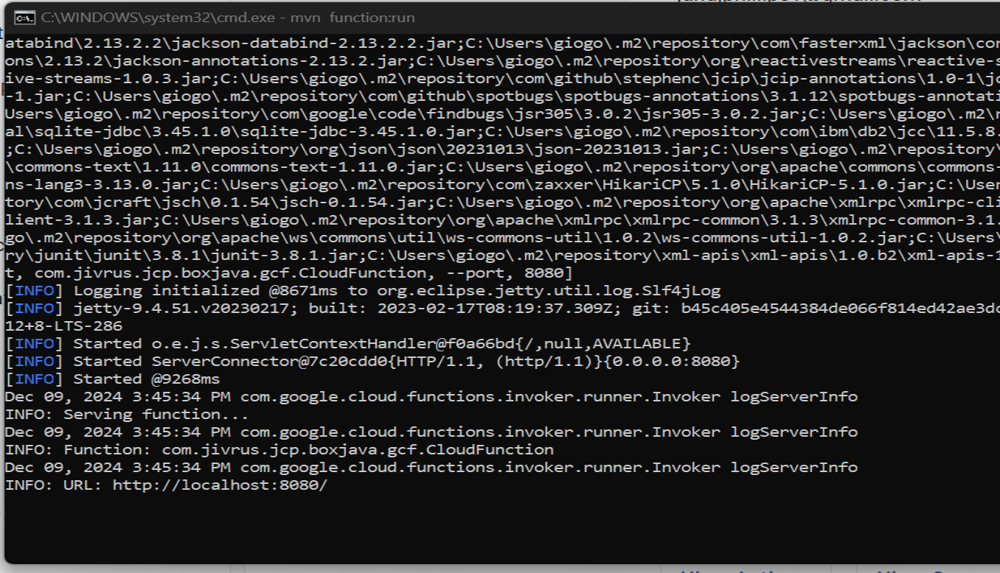

# community-boxes
This repository houses all box development from the open developer community

# Pre-requisites

1. Install Java 17
2. Install and Setup Maven which is compatible with Java 17 https://maven.apache.org/download.cgi

# Local Setup

  1. Fork the Main Repo from here: https://github.com/Jivrus/community-boxes
  2. Clone the forked Repo
  3. The Newly cloned Repo will be your local repo to make all changes
  4. Navigate to box-java (community-boxes>>box-java)
  5. Run the command mvn function:run, this will help you run your changes in the localhost:8080
  
  6. Create a Pull Request by pointing the https://github.com/Jivrus/community-boxes repo as the receiver

# Unit Testing
  1. After successfully setting up the local server at 8080 port, try calling the api's using postman
  2. http://localhost:8080/api/box/odoo-crm/objects 
    - BaseURL - http://localhost:8080
    - path - /api/box
    - box ID - /odoo-crm
    - Box Functions- /objects

# Integration Testing
  1. Integrating testing can be done from our HTTPS Dev and Stage Envs
    ## Play Ground
    a. Dev.ci - https://dev.ci.appiworks.com/playground
    b. Stage Env - https://stage.cd.appiworks.com/playground
    
    ## Connection Explorer

    Create a box/app connection and then see the objects and their functions associated
    a. Dev.ci - https://dev.ci.appiworks.com/connectionexplorer
    b. Stage Env - https://stage.cd.appiworks.com/connectionexplorer

# Publishing
